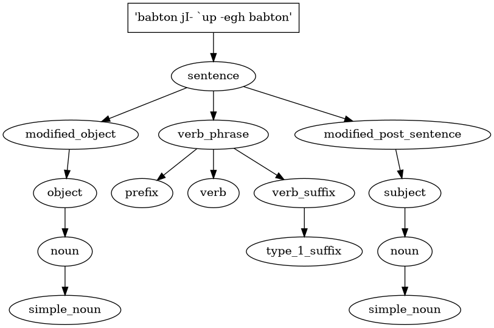

# Klingon Language Parser

This project provides a Klingon language parser that processes input files with Klingon text, grammar, or vocabulary and produces structured output. The parser is built using Python and relies on various resources for Klingon grammar and vocabulary.

---

## Table of Contents

1. [Overview](#overview)
2. [Project Structure](#project-structure)
3. [Installation](#installation)
4. [Usage](#usage)
5. [Visualization Feature](#visualization-feature)
6. [Input and Output Files](#input-and-output-files)
7. [Examples](#examples)

---

## Overview

The Klingon Language Parser project is designed to:
- Parse Klingon text.
- Analyze Klingon grammar and vocabulary.
- Output structured results for linguistic or learning purposes.

---

## Project Structure

The project consists of the following files and directories:
```
final-project/
├── README.md                             # Project documentation (this file)
├── examples/                             # Example input and output files
│   ├── simple_input.txt                  # Sample input file for Klingon parser
│   └── tree_diagram.png                  # Sample visualization of parsed tree
├── resource/                             # Resource files for Klingon lexicon and grammar
│   ├── Klingon Dictionary (Okrand).pdf
│   ├── Klingon_lexicon - FrathWiki.pdf
│   ├── Pages from Klingon Dictionary (Okrand)-2.pdf
│   ├── Pages from Klingon Dictionary (Okrand)-3.pdf
│   └── Pages from Klingon Dictionary (Okrand).pdf
├── scripts/                              # Core scripts for the Klingon parser
│   ├── correct_bnf.py                    # Script for correcting Klingon grammar
│   ├── driver.py                         # Main entry point for running the parser
│   ├── extract-text.py                   # Extracts text from Klingon PDFs using OCR
│   ├── extract-vocab.py                  # Extracts nouns and verbs from Klingon text
│   ├── klingon-grammar.bnf               # Base Klingon grammar file (BNF format)
│   ├── parser.py                         # Contains the Parser class and core parsing logic
│   └── update-ebnf.py                    # Updates Klingon grammar EBNF with extracted vocab
├── klingon-dictionary.txt                # Extracted Klingon dictionary text
├── klingon-grammar.txt                   # Klingon grammar file in plain text
├── klingon-grammar-ebnf.txt              # Klingon grammar in EBNF format
├── klingon-nouns.txt                     # Extracted Klingon nouns
└── klingon-verbs.txt                     # Extracted Klingon verbs
```

### Key Files:
- **`driver.py`**: Main script to run the parser. Use `--infile` and `--visualize` to specify input file and enable visualization.
- **`parser.py`**: Core parsing logic using the `Lark` library and Klingon grammar files.
- **`extract-text.py`**: Converts Klingon PDFs to plain text using OCR (requires Tesseract).
- **`extract-vocab.py`**: Extracts Klingon nouns and verbs from the dictionary.
- **`update-ebnf.py`**: Updates the EBNF grammar with extracted vocabulary.
### Example Input and Output:
- **`examples/simple_input.txt`**: Contains sample Klingon phrases for parsing.

---

## Installation

1. Download and unzip this zip file:
2. Navigate to the project directory:
   ```
   cd final_project/scripts
   ```
3. Install dependencies:
   Make sure you have Python installed, then use `pip` to install the required libraries:
   ```
   pip install argparse pdf2image pytesseract lark
   ```
   Note: You may need to install additional dependencies for `pdf2image` and Tesseract:
   - Install Tesseract OCR: [Installation Guide](https://github.com/tesseract-ocr/tesseract)
   - Install the `poppler-utils` package for `pdf2image`:
     - On Ubuntu:
       ```
       sudo apt-get install poppler-utils
       ```
     - On macOS:
       ```
       brew install poppler
       ```

---

## Usage

To run the parser, use the following command:
```
python driver.py --infile <input-file> --visualize
```

Example:
```
python driver.py --infile ../examples/simple_input.txt --visualize
```

---

## Visualization Feature

The parser can generate a visual representation of the parsed Klingon structure in the form of a tree diagram. This feature is optional and can be enabled using the `--visualize` flag.

### How It Works:
1. The parser processes the input file and generates a structured JSON representation (`tree.json`).
2. If the `--visualize` flag is provided, a tree diagram is created from `tree.json` using the Graphviz library.
3. The output diagram (`tree_diagram.png`) is saved in the `examples/` directory.

### Usage:
To enable visualization, run the parser with the `--visualize` flag:
```
python driver.py --infile <input-file> --visualize
```

### Example Command:
```
python driver.py --infile ../examples/complex_input.txt --visualize
```

### Sample Visualization:
Below is an example of a visualized tree diagram:



---

## Input and Output Files

- **Input File (`infile`)**: This should contain the Klingon text, grammar, or vocabulary that you want to parse. An example file is `simple_input.txt`.
- **Output Files**:
  - **`tree.json`**: The parsed tree structure.
  - **`tree_diagram.png`**: The visualized tree diagram (if `--visualize` is used).

---

## Examples

### Example Command:
```
python driver.py --infile ../examples/simple_input.txt --visualize
```

### Example Input (`simple_input.txt`):
```
babton jI- `up -egh babton
```

### Example Output (`tree.json`):
```
{
    "babton jI- `up -egh babton": {
        "type": "non-terminal",
        "rule:": "sentence",
        "children": [...]
    }
}
```
